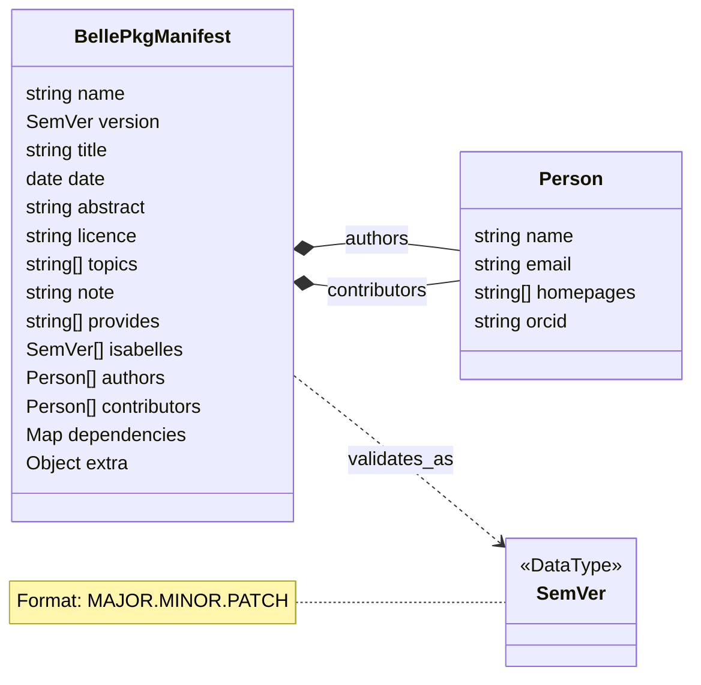

# Belle

**The environment manager for Isabelle/HOL.**

Belle is a package manager for Isabelle/HOL built in Rust. It provides isolated environment-based package management similar to Conda, allowing management of formal verification sessions, theories and AFP dependencies.

## Features

- 🧪 **Isolated Environments**: Create sandboxed environments. Switch between project-specific theory sets without polluting your global sessions.
- 📦 **Multi-Source Fetching**: Download packages directly from the AFP, remote repositories (GitHub), or local directories.
- 🌍 **Cross-Platform**: Native support for Windows, macOS, and Linux (Unix).
- 🔗 **Multi-Version Linking**: Link multiple Isabelle installations (e.g., 2024, 2025.1, 2025.2) and toggle between them.
- 🔄 **Reproducible**: Allows exporting environments to lockfiles so that collaborators can recreate the exact theory stack and Isabelle version.
- 🌲 **Dependency Resolution**: Automatically resolves package dependencies to ensure all required sessions are present before building.
- 🔍 **Discovery & Search**: Search and inspect packages before installing.
- 🚀 **Performance-First (Rust)**: Native performance, with a minimal memory footprint.

## Quick Start

### Installation

Download the latest release from the [Releases](https://github.com/jcbyte/belle/releases).

### Link to Isabelle/HOL

```bash
belle isabelle link /path/to/Isabelle2025-2
```

Replace the path with your actual Isabelle installation directory.

### Source AFP Entries (Packages)

Source the latest entries (packages) metadata from the Archive of Formal Proofs:

```bash
belle source afp update
```

### Create an Environment

```bash
belle env create my-env
```

### Install Packages

```bash
belle add package-name
belle add another-package 2026.1.0
```

## Common Commands

| Command                           | Description                                         |
| --------------------------------- | --------------------------------------------------- |
| `belle add <package>`             | Add a package to current environment                |
| `belle remove <package>`          | Remove a package from current environment           |
| `belle migrate [version]`         | Migrate environment to a specific Isabelle version  |
| `belle update`                    | Update packages in environment                      |
| `belle list`                      | List packages in current environment                |
| `belle env create <name>`         | Create a new environment                            |
| `belle env remove <name>`         | Remove an environment                               |
| `belle env list`                  | List all environments                               |
| `belle env freeze`                | Freeze environment (create lockfile)                |
| `belle env sync`                  | Restore environment from frozen (lockfile)          |
| `belle switch <name>`             | Switch environments                                 |
| `belle source afp list`           | List available AFP repositories                     |
| `belle source afp update`         | Sync the package indexes from the AFP               |
| `belle source remote <url>`       | Add a new remote Git repository as a package source |
| `belle source local <path>`       | Add a local directory as a package source           |
| `belle search <query>`            | Search package registry                             |
| `belle inspect <package>`         | View package details                                |
| `belle cache purge`               | Remove all unused package source files              |
| `belle isabelle link <path>`      | Link an Isabelle installation                       |
| `belle isabelle unlink <version>` | Unlink an Isabelle version                          |
| `belle isabelle list`             | List linked isabelle versions                       |

Use `--help` with any command to see the full list of options.

## Belle Data Directory

By default, all belle data and configuration files are stored in your user's data directory.

| OS      | Default Path                                       |
| ------- | -------------------------------------------------- |
| Linux   | $HOME/.local/share/belle (or $XDG_DATA_HOME/belle) |
| MacOS   | $HOME/Library/Application Support/belle            |
| Windows | %APPDATA%\belle                                    |

If you prefer to store your data elsewhere, the default path can be overridden by setting the `BELLE_HOME` environment variable.

## Package Format

Belle packages are defined by a TOML manifest, `belle-pkg.toml`.


See the example structure at [belle-pkg.toml](belle-pkg.toml) or JSON Schema at [belle-pkg.schema.json](belle-pkg.schema.json) for further details.

## Licence

[Apache License 2.0](LICENSE)
